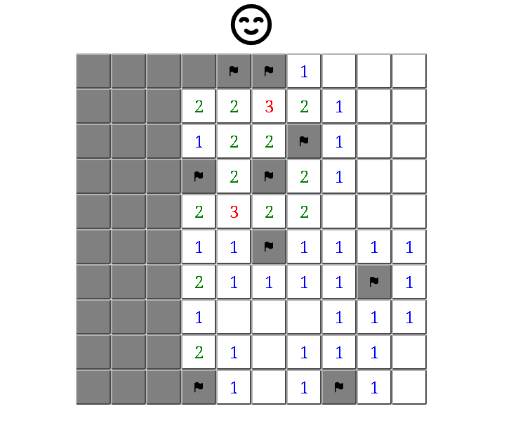

# Minesweeper React
Minesweeper in [ReactJS](https://react.dev/)

# Get Started
```
git clone https://github.com/leandrorsant/minesweeper-react
cd minesweeper-react
npm i
npm start
```

# Screenshots
